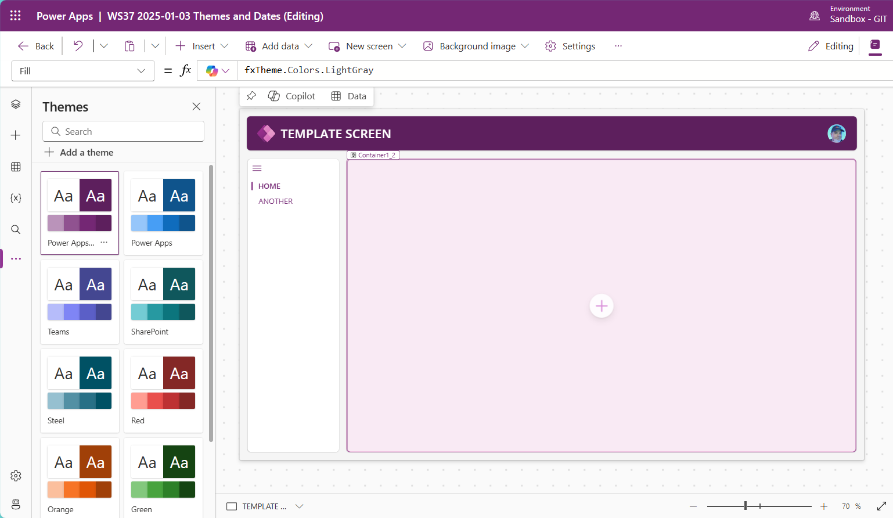
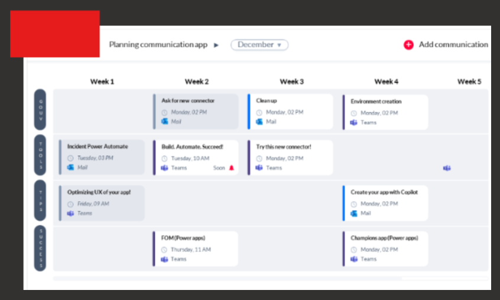

# WS-37-Themes-Dates

- [Workshop GitHub Repository](https://github.com/PowerAppsDarren/Power-Apps-Workshops/tree/main/WS-37-Themes-Dates)

## Extending Modern Themes

Microsoft has given us modern theming, but it still does not cut it. We need to extend it to make it more powerful.

---

## Dates in Power Apps

The week starts on a Monday and ends on a Friday by default.

However, if the first day of the month falls on a workday that is not Monday (e.g., Wednesday), we would start counting the week from that day until Friday, and that would be considered the first week.

The following weeks would then start from the next Monday and continue as Monday to Friday.

This approach focuses only on the workweek because communication should occur exclusively on workdays (Monday to Friday), not on weekends.

### Example:

For January 2025, the first day is a Wednesday (1st Jan). So, the first week would be Wednesday (1st) to Friday (3rd).
The next week would start on Monday (6th) and end on Friday (10th), and so on.

