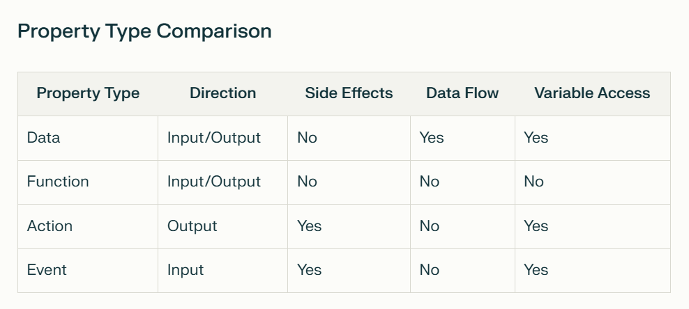

# WS-36-Advanced-Components

## Ideas

- OOP Concepts
- Sharing is Caring
- Property Type Comparison

## Object Oriented Programming (OOP) Concepts

- Class vs Object
    - Class is a blueprint
        - Developers define
    - Object is an instance of a class
        - One or more objects can be created from a class

- Class / Object  
    - Properties
        - Input (Default of classic Text Input)
        - Output (Text of classic Text Input)
    - Methods
        - Rountines that can be called on the object     
        - Hard to think of an example, but we can create one of our own
    - Events
        - Properies that start with On_ 
            - App.OnStart
            - App.OnError 
            - Screen.OnVisible
            - Screen.OnHidden 
            - Button.OnSelect

- OOP Concepts
    - Abstraction - Hiding the complexity
    - Encapsulation - Grouping properties and methods
        - Putting multiple properties and methods in a class
    - Inheritance
        - A class can inherit properties and methods from a base class
        - Related term: interfaces
    - Polymorphism
        - A class can have multiple methods with the same name
        - Related term: overloading

- OOP in PowerFx (Components)
    - Property Types
    - Methods
    - Events
    - Actions

- Sharing with each other
    - What components are out there (gitHub)
- Property Type Comparison

## Property Type Comparison

- Input Property (border color)
- Input / Output
- Variable Access
    - Scrope 

## Examples of Components

- Header
- Menu(s)
- Spinner
- Calculator (conversions - currency, temperature, etc.)
- Label / Input Control Paring (with validation)
- Animated Button (with hover effect)
- Visibility depending on role on menu or header.
- Charts
- Entering text into a component that will be saved to a collection and/or table
 

## Examples of Components (unseen)
 
- Grouping of user-defined functions