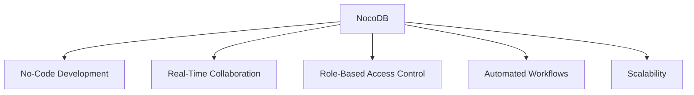

# WS40-NOCODB

NocoDB is an open-source, no-code platform that simplifies database management and application development by allowing users to create and manage databases without writing any code. It features a user-friendly interface that transforms relational databases into a spreadsheet-like format, making it accessible for non-technical users, small businesses, and startups. Key functionalities include:

- **No-Code Development**: Users can build applications visually, defining data models and generating APIs without complex coding.
- **Real-Time Collaboration**: Multiple users can work on the same database simultaneously, enhancing teamwork and productivity.
- **Role-Based Access Control**: Administrators can set permissions to secure sensitive data.
- **Automated Workflows**: Users can automate repetitive tasks through predefined triggers.
- **Scalability**: NocoDB efficiently handles large volumes of data, supporting millions of rows without performance issues.

Overall, NocoDB empowers users to streamline their workflows and increase productivity while maintaining control over their data.

## Key Functionalities Diagram

## NOCODB Links & Resources

>https://railway.com?referralCode=GUiqeH

- https://nocodb.com/
- https://docs.nocodb.com/
- https://data-apis-v2.nocodb.com/
- https://meta-apis-v2.nocodb.com/
- https://app.nocodb.com/
- https://github.com/nocodb/nocodb

- Host: "app.nocodb.com"
- BasePath: "/api/v2"

- https://powerappers.up.railway.app

![[gra_NOCODB_LOGO.png]]

#1c27bd